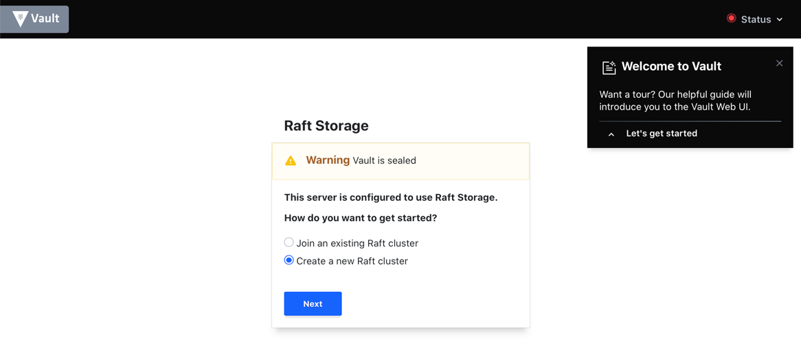
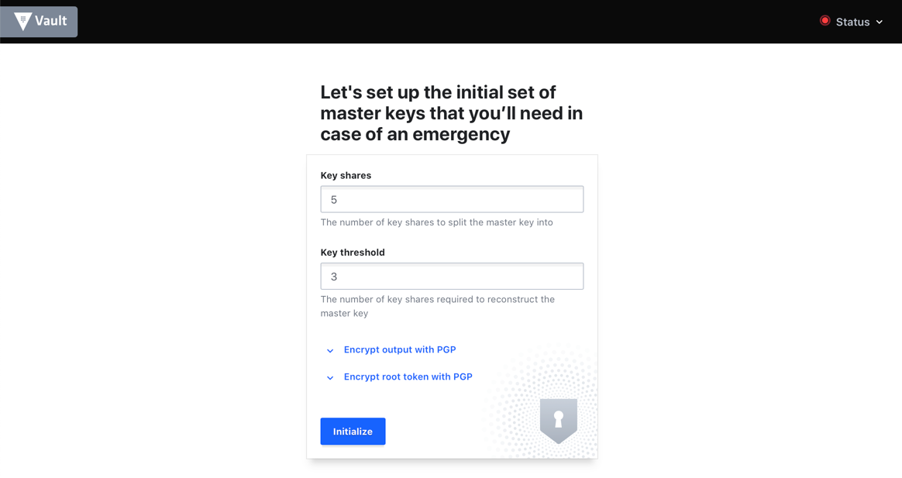
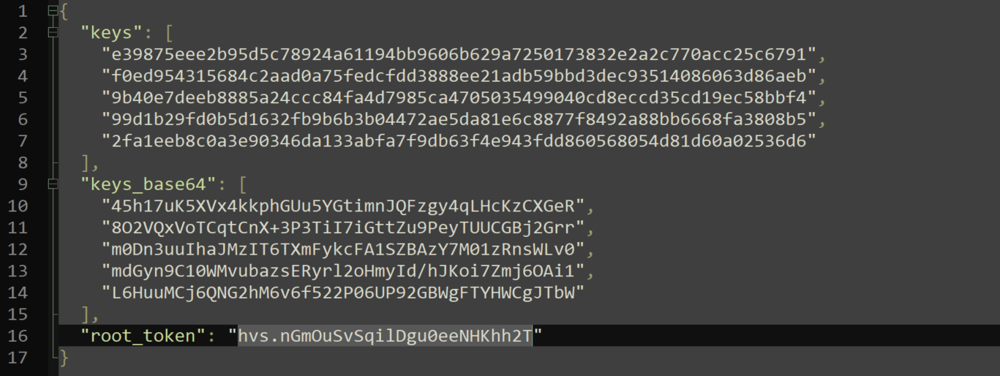
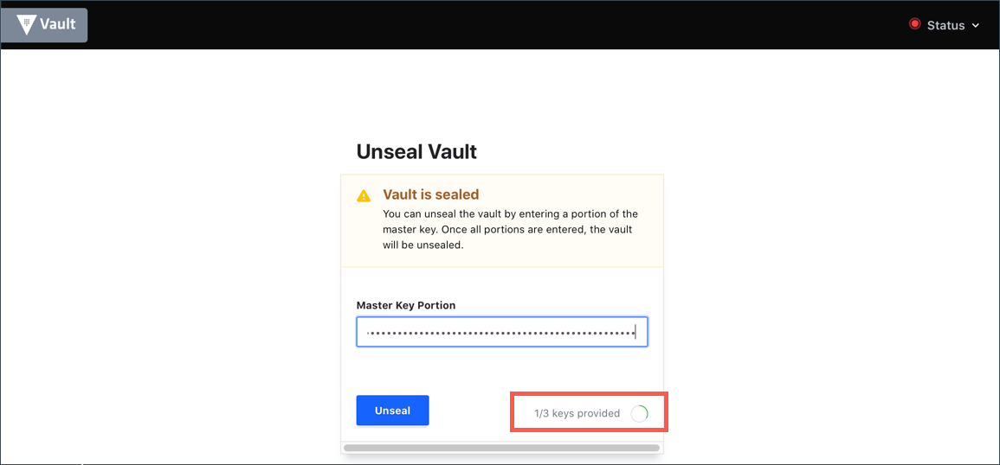
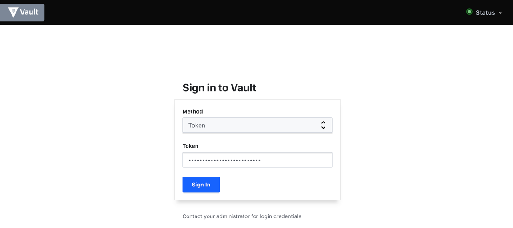

Your team has determined they need Vault to test in their Dev environment. You're setting up the UI mode and just got to the web interface. You're now going to configure . 

 

### Tip

Tip

[Getting started with the UI](https://developer.hashicorp.com/vault/tutorials/getting-started-ui/getting-started-ui)

### Solution

Solution

Follow along from Step 5 of the above link to continue, or see below.

Expand out the left frame, as you no longer need the cli to the right.

In your UI choose to "Create a new Raft Cluster"

Enter 5 in Key shares and 3 in Key thresholds

Click Initialize

You will see the unseal keys and must select to download them. They will become a .json doc in your downloads folder. It should look like this

You will unseal the vault using 3 of the 5 keys. (Any 3 will do). Repeat this step 3 times.

Next, you must present the root token from your downloaded file.

Once you hit "Sign In" you will be presented with the WEB UI Wizard.

Let the wizard show you around the interface and then you're done.

