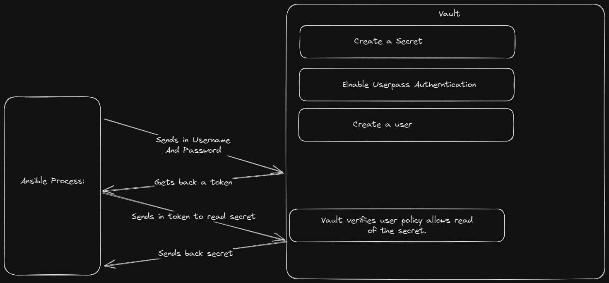

Examine this workflow for the tasks and lab we're about to complete



Your team has determined they need Vault to test in their Dev environment. Hashicorp Vault has been installed on the server. 

Start the server in dev mode

Export the required values to your shell

Verify that the server is running.

<br>

### Tip

<details>
<summary>Tip</summary>

[Getting started with Dev Server](https://developer.hashicorp.com/vault/tutorials/getting-started/getting-started-dev-server)

</details>

### Solution
<details>
<summary>Solution</summary>

Start the Vault server in dev mode.

```plain
vault server -dev &
```{{exec}}

Export the values you need. These can be found in the output of the above command

```plain
export VAULT_ADDR='http://127.0.0.1:8200'
export VAULT_TOKEN=" <token from output> "
```

Verify that the server is running

```plain
vault status
```{{exec}}

Notice the Seal Type and the Sealed value.

Verify the open ports for Vault

```plain
lsof -i :8200
ss -ntulp | grep 820
```{{exec}}

Now that you have the dev vault started you can continue.

</details>