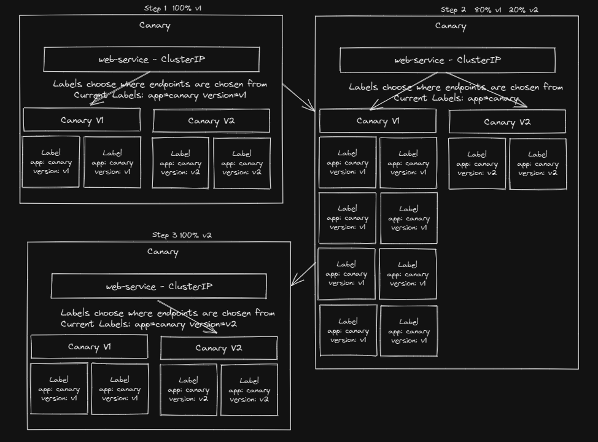

Inspect the deployments_practice.yaml file in your home directory

Run this file and inspect the resources it creates.

This is an image that shows what this lab does. Reference it to better understand what you're doing.



<br>

<details>
<summary>Solution</summary>
Inspect the file and see that there are 4 configuration maps and 4 deployments

```plain 
vi /root/deployments_practice.yaml
```{{exec}}

Deploy the resources
```plain
kubectl create -f /root/deployments_practice.yaml
```{{exec}}

Inspect the resources that were created

```plain
kubectl get cm
```{{exec}}

```plain
kubectl get deployments
```{{exec}}

```plain
kubectl get pods
```{{exec}}
</details>