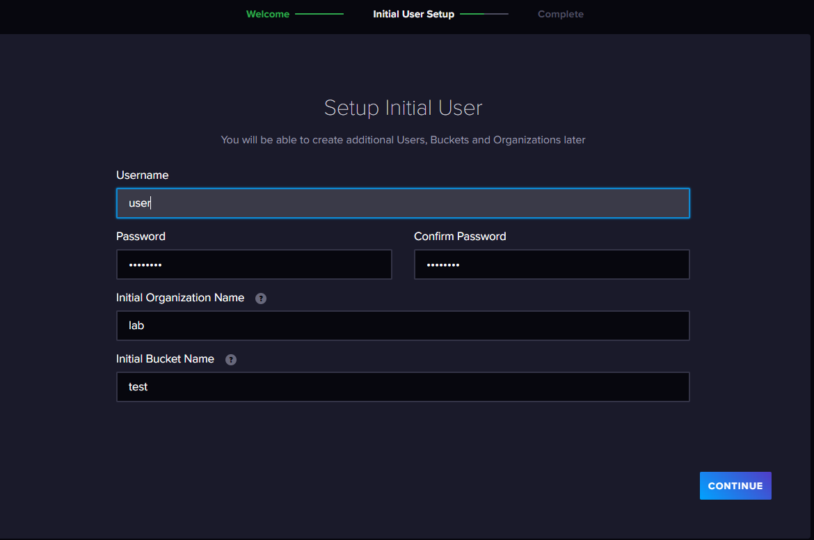

Your team has decided that the data will be collected by Telegraf and sent for aggregation to influxdb version 2.7. 

Install InfluxDB2.

Verify that InfluxDB2 is running on your system.

Setup an organization, bucket, and token. Collect and copy your data toke from the UI.

<br>

### Solution
<details>
<summary>Solution</summary>
Install the InfluxDB2 repository.

```plain
wget -q https://repos.influxdata.com/influxdata-archive_compat.key
echo '393e8779c89ac8d958f81f942f9ad7fb82a25e133faddaf92e15b16e6ac9ce4c influxdata-archive_compat.key' | sha256sum -c && cat influxdata-archive_compat.key | gpg --dearmor | tee /etc/apt/trusted.gpg.d/influxdata-archive_compat.gpg > /dev/null
echo 'deb [signed-by=/etc/apt/trusted.gpg.d/influxdata-archive_compat.gpg] https://repos.influxdata.com/debian stable main' | tee /etc/apt/sources.list.d/influxdata.list
```{{exec}}

Install InfluxDB2

```plain
apt-get update && apt-get -y install influxdb2
```{{exec}}

Start InfluxDB2

```plain
systemctl start influxdb      
systemctl enable influxdb
```{{exec}}

Verify InfluxDB2 is listening on the correct port.

```plain
ss -ntulp | grep 8086
lsof -i :8086
```{{exec}}

Connect to InfluxDB, set up your organization, bucket, and token. Copy those pieces of information out to a notepad, you will need them shortly.

{{TRAFFIC_HOST1_8086}}



Once this is complete you have completed this section of the lab.

</details>